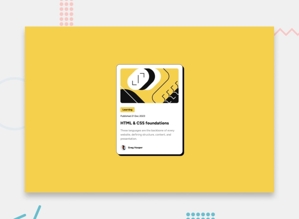
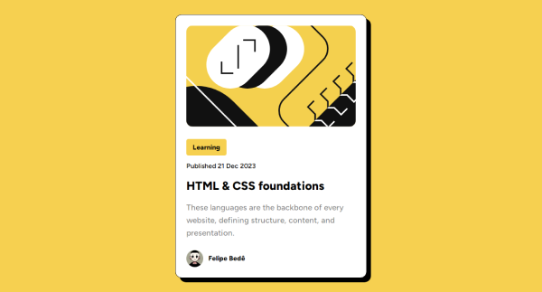

# Frontend Mentor - Blog preview card

This project consists of solving the Blog preview card challenge
from Mentor FrontEnd.

## 🎯 Challenge

## 🚀 Result

## 💻 Technologies used
    - HTML5
    - CSS3

## 🔗 Credits
- Challenge by [FrontEnd Mentor](https://www.frontendmentor.io/home).
- Challenge URL [NFT preview card component](https://www.frontendmentor.io/challenges/blog-preview-card-ckPaj01IcS/hub).